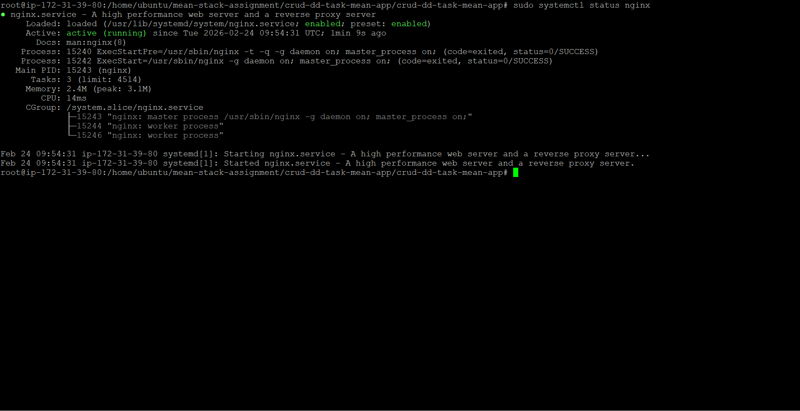
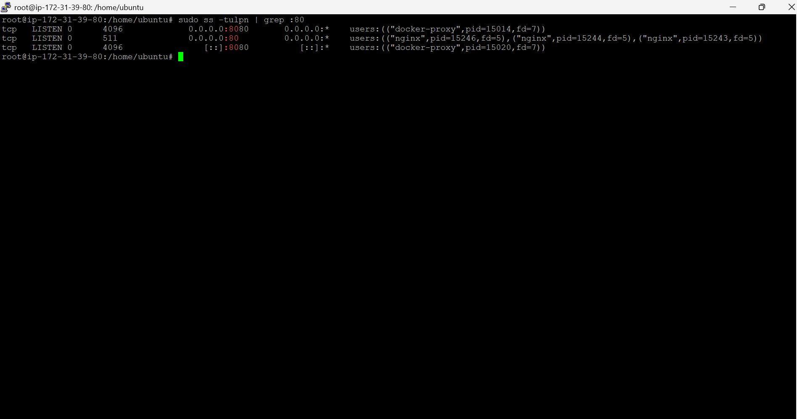
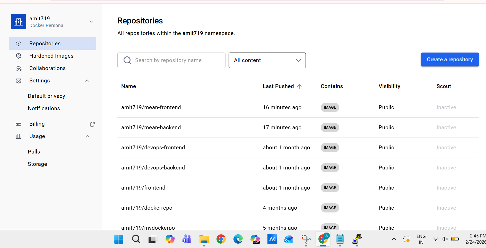
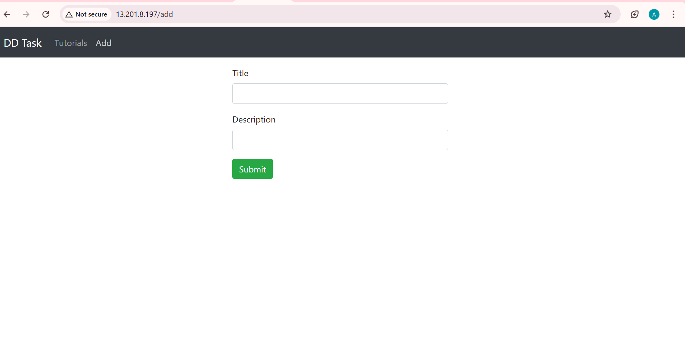
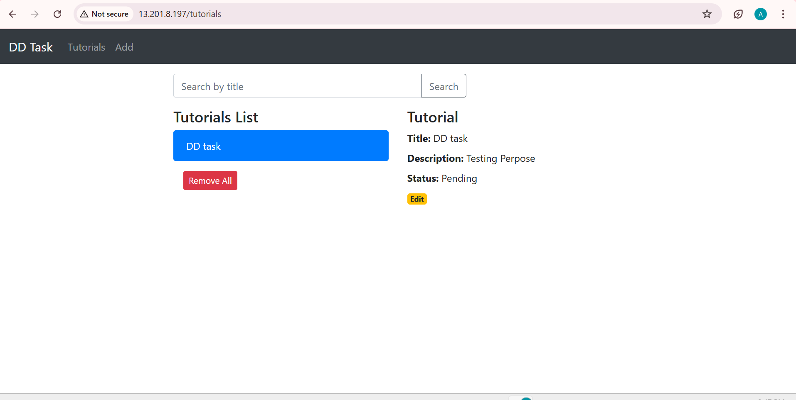

# MEAN Stack CRUD Application - DevOps Deployment

##  Project Overview
This project demonstrates the complete deployment of a MEAN (MongoDB, Express, Angular, Node.js) stack application. The deployment is fully automated using modern DevOps practices, including containerization, CI/CD pipelines, and a reverse proxy setup.

##  Tech Stack & Infrastructure
- **Frontend:** Angular 15
- **Backend:** Node.js & Express.js
- **Database:** MongoDB
- **Reverse Proxy:** Nginx (Listening on Port 80)
- **Containerization:** Docker & Docker Compose
- **CI/CD:** GitHub Actions
- **Cloud Hosting:** AWS EC2 (Ubuntu 24.04)

##  Live Access
- **Application URL:** (http://13.201.8.197)
- **Nginx Entry Point:** Port 80 (Standard HTTP)

---

## Proof of Work

### 1. Nginx Reverse Proxy Setup
Implemented Nginx to handle incoming traffic on Port 80 and forward it to the Dockerized frontend on Port 4200.
- **Status:** Active and Running

### 2. Port Verification
Verified using `ss -tulpn` that Nginx is successfully managing Port 80.

### 3. CI/CD Pipeline (GitHub Actions)
Automated build and deployment process. Every push to the `main` branch triggers a new build and update on the AWS server.
.png)

### 4. Docker Hub Repositories
Custom images for both frontend and backend are stored on Docker Hub.

### 5. Application UI
Live screenshots of the CRUD functionality working on the AWS instance.

---

##  Deployment Steps (Brief)
1. **Dockerization:** Created Dockerfiles for both frontend and backend and orchestrated them using `docker-compose.yml`.
2. **Nginx Configuration:** Configured Nginx as a reverse proxy to manage traffic and improve security.
3. **CI/CD:** Configured GitHub Actions to build Docker images, push to Docker Hub, and SSH into AWS for deployment.
4. **Storage Management:** Optimized Docker system and volumes to maintain disk space on the AWS VM.

